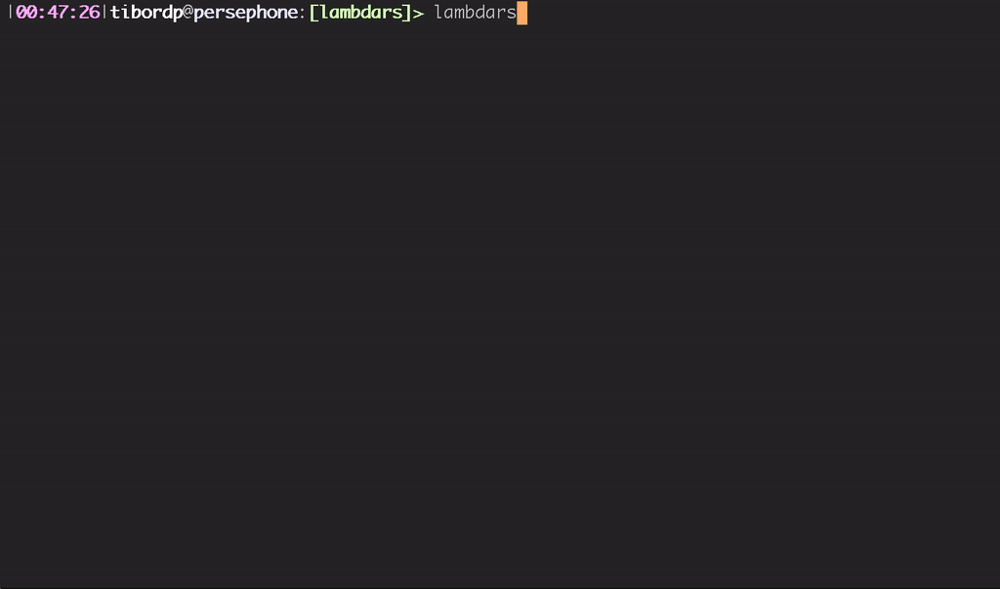

# lambdars

lambdars is a REPL for playing with untyped lambda calculus.

## Demo



## Usage

lambdars accepts a lambda expression on every line and then tries to reduce it to a canonical form with a sequence of β-reductions and α-conversions.

Both `λ` and `\` are accepted for specifying a lambda abstraction, for example:

```
> (\f.\x.f (f x)) (\f.\x.f (f x))
 INFO  lambdars::runtime > Reduced in 6 iterations, total α: 3, total β: 6
λx.λy.x (x (x (x y)))
```

lambdars also supports defining macros that are substituted before reduction in order to make the lengthy expressions a bit more manageable:

```
> #define 0 \f.\x.x
> #define 1 \f.\x.f x
> #define plus \m.\n.\f.\x.m f (n f x)
> plus 1 1
 INFO  lambdars::runtime > Reduced in 6 iterations, total α: 2, total β: 6
λx.λy.x (x y)
```

All the macro definitions are eagerly evaluated (and reduced to canonical form). In order to give a name to a lambda expression that may not have a canonical form such as the Y-combinator or `(λx.x x) (λx.x x)`, a `#declare` command can be used. In this case, no substitution will be performed and macro will be stored as-is. 

All the defined macros can be dumped with `#dump`.

The result of previous reduction is available with `@`:
```
> \x.x x
λx.x x
> @ @
 WARN  lambdars > Runtime error: Exceeded limit of 100 iterations.
```

As a lambda expression may not converge to a normal form by repeated β and α reductions (lossely speaking, may never terminate), there are some execution limits in place, they can be controlled as such:

```
#max_reductions 10000
#max_depth 1000
#max_size 1000000
```

A preamble file (see e.g. [Church numerals and combinators](./examples/church.txt)) can be specified using a command line parameter

```
lambdars --preamble ./example/church.txt
```

## Installation

lambdars can be built using standard Rust tooling out of the box, but it requires nightly compiler due to `box_syntax` and `box_patterns` features that are not stabilized yet.

```
$ git clone https://github.com/tibordp/lambdars.git
$ cd lambdars
$ cargo +nightly install --path .
$ lambdars
>
```

